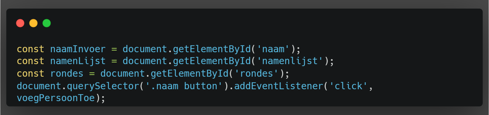

# Portfolio-Web-Advanced
Dit is mijn geavanceerde webportfolio. Mijn project bevat 3 pagina's: Home, API en Scorekeeper.
- De homepagina bevat een korte introductie over mij en mijn projecten.
- De API-pagina bevat een app om je het weer te geven.
- De Scorekeeper-pagina bevat een app om de score bij te houden van een spel.

## Requirements
Hier is de lijst van de vereiste items in het project:
- Elementen selecteren
- Elementen manipuleren
- Event aan een element koppelen
- Formulier valideren
- Gebruiken van een constante
- Gebruiken van template literals
- Destructuring
- Spread & Rest operator
- Iteration over een array
- Arrow function
- Callback function
- Promise
- Consumer methods
- Async & Await
- Self executing function
- Fetch om data op te halen
- JSON manipuleren en weergeven
- Basis CSS Animatie
- Gebruiken van een flexbox of CSS grid
- Gebruik van LocalStorage

## Requirements inside my project

### Elementen selecteren:
> Dit wordt zo wat overal gebruikt maar het eerste voorkomen hiervan is in Scorekeeper.js.
>
> 

### Elementen manipuleren:
> Het eerste element dat we manipuleren is de innerHTML van de namenlijst in Scorekeeper.js, waarbij we de namen en scores van de spelers weergeven.
>
> 

### Event aan een element koppelen:
> Het eerste element dat wordt ingeladen op de website waaraan een event vast hangt, is de "Toevoegen" button in Scorekeeper.js, die de mogelijkheid geeft om een speler toe te voegen.
>
> 

### Formulier valideren:
> Het formulier dat ik valideer, is de registratiepagina. Hierbij maak ik gebruik van verschillende vereisten, zoals een geldig emailadres. Het script vind je in Register.js.
>
> 

### Gebruiken van een constante:
> Ik gebruik constanten om elementen en gegevens die niet veranderen op te slaan, zoals `const naamInvoer` in Scorekeeper.js.
>
> 

### Gebruiken van template literals:
> Ik gebruik template literals voor het dynamisch genereren van HTML en tekst, zoals bij het weergeven van de spelerslijst in Scorekeeper.js.
>
> 

### Destructuring:
> Ik gebruik destructuring om objecten gemakkelijk te kunnen deconstrueren, zoals bij het ophalen van gebruikersgegevens in Account.js.
>
> 

### Spread & Rest operator:
> Ik gebruik de spread en rest operator voor het kopiëren en combineren van objecten en arrays, zoals bij het updaten van de spelerslijst in Scorekeeper.js.
>
> 

### Iteration over een array:
> Ik gebruik array-iteratiemethoden om door arrays te lopen, zoals het itereren over de namenlijst in Scorekeeper.js.
>
> 

### Arrow function:
> Ik gebruik arrow functions voor kortere functie-syntax, vooral bij callbacks, zoals bij het toevoegen van event listeners in Scorekeeper.js.
>
> 

### Callback function:
> Ik gebruik callbackfuncties om functionaliteit toe te voegen die wordt uitgevoerd nadat een bepaalde actie is voltooid, zoals bij het updaten van de score in Scorekeeper.js.
>
> 

### Promise:
> Ik gebruik Promises om asynchrone operaties af te handelen, zoals bij het ophalen van de weersinformatie in API.js.
>
> 

### Consumer methods:
> Ik gebruik consumer methods zoals `then` en `catch` om de resultaten van Promises te verwerken, zoals bij het verwerken van de respons van de weer-API in API.js.
>
> 

### Async & Await:
> Ik gebruik `async` en `await` voor het schrijven van asynchrone code op een meer synchrone manier, zoals bij het ophalen van data in API.js.
>
> 

### Self executing function:
> Ik gebruik self-executing functions om code onmiddellijk uit te voeren zonder expliciete aanroep, zoals bij het inladen van de navigatiebalk in Nav.js.
>
> 

### Fetch om data op te halen:
> Ik gebruik `fetch` om data op te halen van een API, zoals bij het ophalen van weersgegevens in API.js.
>
> 

### JSON manipuleren en weergeven:
> Ik gebruik JSON om gegevens op te slaan en op te halen uit de LocalStorage, zoals bij het opslaan van gebruikersgegevens in Register.js.
>
> 

### Basis CSS Animatie:
> Ik gebruik basis CSS-animaties om visuele effecten toe te voegen aan mijn project, zoals bij de overgangseffecten op de Scorekeeper-pagina.
>
> 

### Gebruiken van een flexbox of CSS grid:
> Ik gebruik flexbox en CSS grid voor de lay-out van mijn pagina's, zoals bij het structureren van de Scorekeeper-pagina.
>
> 

### Gebruik van LocalStorage:
> Ik gebruik LocalStorage om gegevens op te slaan die behouden blijven na het verversen van de pagina, zoals gebruikersinformatie in Register.js.
>
> 

## Bronvermeldingen

> problemen met het weergeven van de icons van de api
>
> 
>
> > 

> problemen met de de witruimte na invoer
> 
> 

>Hoe een nieuwe pagina openen via js
> 
> 

> Gebruikte API
> 
> https://openweathermap.org/api